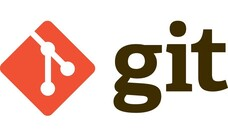

# Introduction to Git and Github

## What is Git?

Git is a modern **VCS (Version Control System)** built by **Linus Torvalds** (the famous creator of the Linux operating system kernel).

## Why do we use Git?

- **Version Control** - Git allows us to keep track of the changes we make to our code. This is very useful when we want to go back to a previous version of our code.
- **Collaborate** - Git allows us to collaborate with other developers on the same project. This is very useful when we are working on a project with other developers.

## What is a Git Repository?

A Git repository is a directory that contains all the files of a project. It also contains the history of all the changes made to the project.

## What is Github? How is it different from Git?

**Github** is a website (now acquired by Microsoft) that allows us to host our Git repositories in the cloud. It also allows us to collaborate with other developers on the same project.

**Git** on the other hand is the actual version control system that allows us to keep track of the changes we make to our code.

## Git commands

### `git init`

- It's a one-time command is used to **initialize a new Git repository**.
- It creates a new subdirectory named `.git` that contains all of your necessary repository files to track the history of your project.

> **Note**: You might not be able to see the `.git` directory because it's a hidden directory (since the name starts with a dot '.'). To see hidden directories, you can use the `ls -a` command.
>
>
> **Note**: `mkdir` is used to create a new directory. `cd` is used to change the current directory. You can use the `pwd` command to print the current directory.

[Read More](https://www.atlassian.com/git/tutorials/setting-up-a-repository/git-init)

### `git status`

- It's a command that is used to **check the status of the repository**. It tells us what files we have added, modified or deleted.
- **Untracked** basically means that Git sees a file you didn’t have in the previous snapshot (commit), and which hasn’t yet been staged. Git won't track any files until you explicitly tell it to do so.
- **Unstaged** basically means that Git has been tracking the file but the file has been modified and the changes haven't been tracked yet.

To **stage** a file means to add it to the staging area. The staging area is a place where Git stores the changes that are going to be committed. To **unstage** a file means to remove it from the staging area.

[Read More](https://www.atlassian.com/git/tutorials/inspecting-a-repository)

### `git add`

- It's a command to track **untracked files**.
- It's a command that is used to **add files to the staging area**.

[Read More](https://www.atlassian.com/git/tutorials/saving-changes)

### `git commit`

- It's a command that is used to **commit the changes** that are in the staging area.
- It adds an entry to the history of the project.
- To make it more clear as to what the change actually does git allows us to add a message along with the commit. This message is called the **commit message**.
- Syntax: `git commit -m "commit message"`

[Read More](https://www.atlassian.com/git/tutorials/saving-changes/git-commit)

### `git log`

- It's a command that is used to **view the history of the project**.

[Read more](https://www.atlassian.com/git/tutorials/git-log)

### `git remote`

- It lets you create, view, and delete connections to other repositories.
- Add a new remote repository: `git remote add origin <remote repository URL>`. Here `origin` is the name of the remote repository.

[Read More](https://www.atlassian.com/git/tutorials/syncing#)

### `git push`

- It is used to upload local repository content to a remote repository

[Read More](https://www.atlassian.com/git/tutorials/syncing/git-push)

> **Note**: If you don't have SSH keys setup, you will have to enter your Github username and password every time you push to Github. So it's better to setup SSH keys. See the steps [here](https://docs.github.com/en/authentication/connecting-to-github-with-ssh/generating-a-new-ssh-key-and-adding-it-to-the-ssh-agent).
>
> As a temporary measure you can also use PAT (Personal Access Tokens), visit [github.com/settings/tokens](https://github.com/settings/tokens) and create a token for yourself. Then use the token as your password when pushing to Github.

The syntax for `git push` is `git push <remote repository name> <branch name>`. For example, `git push origin main`.

### `git branch`

- It's a command that used to deal with git branches.
- **Branch** are effectively a pointer to a snapshot of your changes.
  - To list all the branches in the repository, use the `git branch` command.
  - To list all the remote branches in the repository, use the `git branch -r` command.
  - To list both local and remote branches, use the `git branch -a` command.
  - You can also create a new branch using the `git branch <branch name>` command.

[Read More](https://www.atlassian.com/git/tutorials/using-branches)

Refer to this visualization tool to understand git branches better: [learngitbranching.js.org](https://learngitbranching.js.org/?NODEMO)

### `git checkout`

- It's a command that is used to **switch between branches**.
- You can also use it to **create a new branch** and **switch to it** at the same time using the `-b` flag. For example, `git checkout -b <branch name>`.

[Read More](https://www.atlassian.com/git/tutorials/using-branches/git-checkout)

### `git pull`

- It is used to fetch and download content from a remote repository and immediately update the local repository to match that content.

[Read More](https://www.atlassian.com/git/tutorials/syncing/git-pull)

### `git clone`

- It is used to make a local copy of a Github Repository

[Read More](https://www.atlassian.com/git/tutorials/setting-up-a-repository/git-clone)
